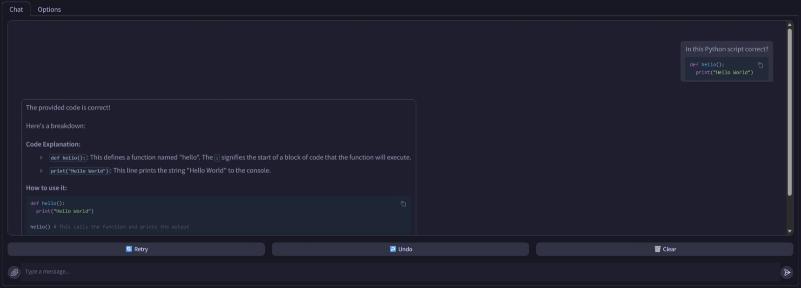

# SD Forge Ollama
This is an Extension for the [Forge Webui](https://github.com/lllyasviel/stable-diffusion-webui-forge), which adds a new Tab to chat with a LLM model locally via [Ollama](https://ollama.com/), built on [Gradio](https://github.com/gradio-app/gradio)'s `ChatInterface` component.

#### Prerequisite
- Install [Ollama](https://ollama.com/download)

## Features
- Chat with a LLM in a GUI, completely locally
- Download a new model given the correct `ollama` syntax
    - refer to: https://ollama.com/library
- Select different models to chat with
    - Different models specialize in different areas, such as coding or creative writing
- Manually unload the model to free up memory
- Save and load the chat history to continue a conversation
    - Simply enter a filename, it will be saved in a `json` format in the `logs` folder; select a filename from the dropdown to load the history again

#### Configs
- **Default Model:** Select which model to start the UI with
    - `default:` The first entry in your model list
- **Keep Alive Duration:** How long to keep the model in memory; for larger models, the initial loading may take a long time; set this value higher to keep the model longer; set to `0` to immediately unload after a message; set to `-1` to never unload
    - `default:` 5 minutes
- **History Depth:** How many previous messages to send to the model; larger value increases the memory usage and may exceed the token limit of the model
    - `default:` 8 messages *(4 query + 4 reply)*

#### Gradio Built-In Features
- Support multi-line text input
    - `Enter` for submit; `Shift + Enter` for newline
- Support markdown for both query and response
    - **\`\`\`** for code block; **\`** for inline code; **\*** for italic; **\*\*** for bold; etc.
- Support context retention
    - You can ask the model to further explain the previous response, etc.
- Press **Retry** to send the same query again *(to get a different response)*
- Press **Undo** to delete the previous messages
- Press **Clear** to reset the chat history
- Stream response in chunks instead of waiting for the entire paragraph
- Support file uploads
    - For `images`, a vision model *(**eg.** [llava:7b](https://ollama.com/library/llava))* is required
    - Most common text files *(`.txt`, `.json`, `.yaml`, `.xml`, `.md`)* should be supported
    - `.pdf` is not supported due to the need of additional package...
